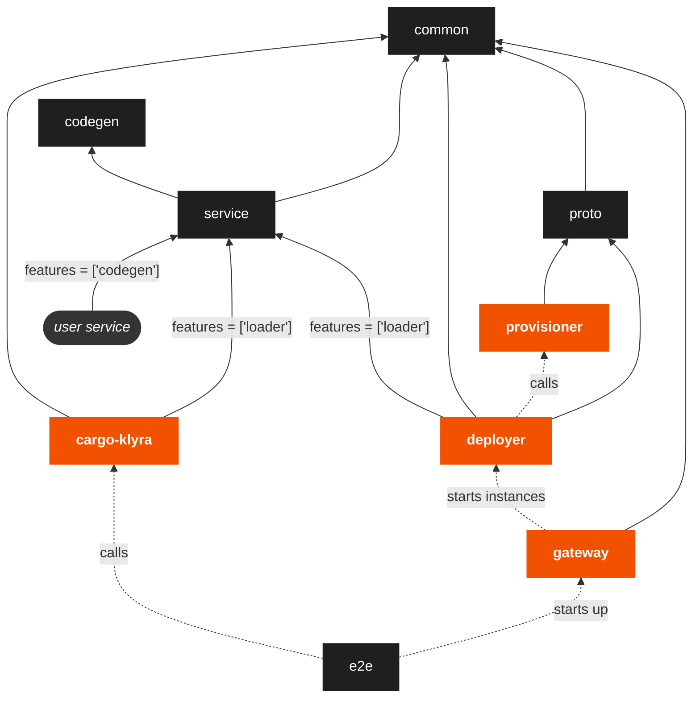

# Contributing

## Raise an Issue

Raising [issues](https://github.com/klyra-hq/klyra/issues) is encouraged. We have some templates to help you get started.

## Docs

If you found an error in our docs, or you simply want to make them better, contributions to our [docs](https://github.com/klyra-hq/klyra-docs)
are always appreciated!

## Running Locally
You can use Docker and docker-compose to test klyra locally during development. See the [Docker install](https://docs.docker.com/get-docker/)
and [docker-compose install](https://docs.docker.com/compose/install/) instructions if you do not have them installed already.

```bash
git clone git@github.com:klyra-hq/klyra.git
cd klyra
```

You should now be ready to setup a local environment to test code changes to core `klyra` packages as follows:

Build the required images with:

```bash
make images
```

> Note: The current [Makefile](https://github.com/klyra-hq/klyra/blob/main/Makefile) does not work on Windows systems by itself - if you want to build the local environment on Windows you could use [Windows Subsystem for Linux](https://learn.microsoft.com/en-us/windows/wsl/install). Additional Windows considerations are listed at the bottom of this page.

The images get built with [cargo-chef](https://github.com/LukeMathWalker/cargo-chef) and therefore support incremental builds (most of the time). So they will be much faster to re-build after an incremental change in your code - should you wish to deploy it locally straight away.

You can now start a local deployment of klyra and the required containers with:

```bash
make up
```

> Note: Other useful commands can be found within the [Makefile](https://github.com/klyra-hq/klyra/blob/main/Makefile).

The API is now accessible on `localhost:8000` (for app proxies) and `localhost:8001` (for the control plane). When running `cargo run --bin cargo-klyra` (in a debug build), the CLI will point itself to `localhost` for its API calls.

In order to test local changes to the `klyra-service` crate, you may want to add the below to a `.cargo/config.toml` file. (See [Overriding Dependencies](https://doc.rust-lang.org/cargo/reference/overriding-dependencies.html) for more)

``` toml
[patch.crates-io]
klyra-service = { path = "[base]/klyra/service" }
klyra-aws-rds = { path = "[base]/klyra/resources/aws-rds" }
klyra-persist = { path = "[base]/klyra/resources/persist" }
klyra-shared-db = { path = "[base]/klyra/resources/shared-db" }
klyra-secrets = { path = "[base]/klyra/resources/secrets" }
klyra-static-folder = { path = "[base]/klyra/resources/static-folder" }
```

Prime gateway database with an admin user:

```bash
docker compose --file docker-compose.rendered.yml --project-name klyra-dev exec gateway /usr/local/bin/service --state=/var/lib/klyra init --name admin --key test-key
```

Login to klyra service in a new terminal window from the main klyra directory:

```bash
cargo run --bin cargo-klyra -- login --api-key "test-key"
```

cd into one of the examples:

```bash
git submodule init
git submodule update
cd examples/rocket/hello-world/
```

Create a new project, this will start a deployer container:

```bash
# the --manifest-path is used to locate the root of the klyra workspace
cargo run --manifest-path ../../../Cargo.toml --bin cargo-klyra -- project new
```

Verify that the deployer is healthy and in the ready state:

```bash
cargo run --manifest-path ../../../Cargo.toml --bin cargo-klyra -- project status
```

Deploy the example:

```bash
cargo run --manifest-path ../../../Cargo.toml --bin cargo-klyra -- deploy
```

Test if the deploy is working:

```bash
# the Host header should match the Host from the deploy output
curl --header "Host: {app}.unstable.klyraapp.rs" localhost:8000/hello
```

View logs from the current deployment:

```bash
# append `--follow` to this command for a live feed of logs
cargo run --manifest-path ../../../Cargo.toml --bin cargo-klyra -- logs
```

### Testing deployer only
The steps outlined above starts all the services used by klyra locally (ie. both `gateway` and `deployer`). However, sometimes you will want to quickly test changes to `deployer` only. To do this replace `make up` with the following:

```bash
docker-compose -f docker-compose.rendered.yml up provisioner
```

This prevents `gateway` from starting up. Now you can start deployer only using:

```bash
provisioner_address=$(docker inspect --format '{{(index .NetworkSettings.Networks "klyra_default").IPAddress}}' klyra_prod_hello-world-rocket-app_run)
cargo run -p klyra-deployer -- --provisioner-address $provisioner_address --provisioner-port 8000 --proxy-fqdn local.rs --admin-secret test-key --project <project_name>
```

The `--admin-secret` can safely be changed to your api-key to make testing easier. While `<project_name>` needs to match the name of the project that will be deployed to this deployer. This is the `Cargo.toml` or `Klyra.toml` name for the project.

### Using Podman instead of Docker
If you are using Podman over Docker, then expose a rootless socket of Podman using the following command:

```bash
podman system service --time=0 unix:///tmp/podman.sock
```

Now make docker-compose use this socket by setting the following environment variable:

```bash
export DOCKER_HOST=unix:///tmp/podman.sock
```

klyra can now be run locally using the steps shown earlier.

> Note: Testing the `gateway` with a rootless Podman does not work since Podman does not allow access to the `deployer` containers via IP address!

## Running Tests

klyra has reasonable test coverage - and we are working on improving this
every day. We encourage PRs to come with tests. If you're not sure about
what a test should look like, feel free to [get in touch](https://discord.gg/H33rRDTm3p).

To run the unit tests for a spesific crate, from the root of the repository run:

```bash
# replace <crate-name> with the name of the crate to test, e.g. `klyra-common`
cargo test --package <crate-name> --all-features --lib -- --nocapture
```

To run the integration tests for a spesific crate (if it has any), from the root of the repository run:

```bash
# replace <crate-name> with the name of the crate to test, e.g. `cargo-klyra`
cargo test --package <crate-name> --all-features --test '*' -- --nocapture
```

To run the end-to-end tests, from the root of the repository run:

```bash
make test
```

> Note: Running all the end-to-end tests may take a long time, so it is recommended to run individual tests shipped as part of each crate in the workspace first.
## Committing

We use the [Angular Commit Guidelines](https://github.com/angular/angular/blob/master/CONTRIBUTING.md#commit). We expect all commits to conform to these guidelines.

Furthermore, commits should be squashed before being merged to master.

Before committing:
- Make sure your commits don't trigger any warnings from Clippy by running: `cargo clippy --tests --all-targets`. If you have a good reason to contradict Clippy, insert an `#[allow(clippy::<lint>)]` macro, so that it won't complain.
- Make sure your code is correctly formatted: `cargo fmt --all --check`.
- Make sure your `Cargo.toml`'s are sorted: `cargo sort --workspace`. This command uses the [cargo-sort crate](https://crates.io/crates/cargo-sort) to sort the `Cargo.toml` dependencies alphabetically.
- If you've made changes to examples, make sure the above commands are ran there as well.

## Project Layout
The folders in this repository relate to each other as follow:



First, `provisioner`, `gateway`, `deployer`, and `cargo-klyra` are binary crates with `provisioner`, `gateway` and `deployer` being backend services. The `cargo-klyra` binary is the `cargo klyra` command used by users.

The rest are the following libraries:
- `common` contains shared models and functions used by the other libraries and binaries.
- `codegen` contains our proc-macro code which gets exposed to user services from `service` by the `codegen` feature flag. The redirect through `service` is to make it available under the prettier name of `klyra_service::main`.
- `service` is where our special `Service` trait is defined. Anything implementing this `Service` can be loaded by the `deployer` and the local runner in `cargo-klyra`.
   The `codegen` automatically implements the `Service` trait for any user service.
- `proto` contains the gRPC server and client definitions to allow `deployer` to communicate with `provisioner`.
- `e2e` just contains tests which starts up the `deployer` in a container and then deploys services to it using `cargo-klyra`.

Lastly, the `user service` is not a folder in this repository, but is the user service that will be deployed by `deployer`.

## Windows Considerations
Currently, if you try to use 'make images' on Windows, you may find that the shell files cannot be read by Bash/WSL. This is due to the fact that Windows may have pulled the files in CRLF format rather than LF[^1], which causes problems with Bash as to run the commands, Linux needs the file in LF format. 

Thankfully, we can fix this problem by simply using the `git config core.autocrlf` command to change how Git handles line endings. It takes a single argument:

```
git config --global core.autocrlf input
```

This should allow you to run `make images` and other Make commands with no issues.

If you need to change it back for whatever reason, you can just change the last argument from 'input' to 'true' like so:
```
git config --global core.autocrlf true
```
After you run this command, you should be able to checkout projects that are maintained using CRLF (Windows) again.

[^1]: https://git-scm.com/book/en/v2/Customizing-Git-Git-Configuration#_core_autocrlf
