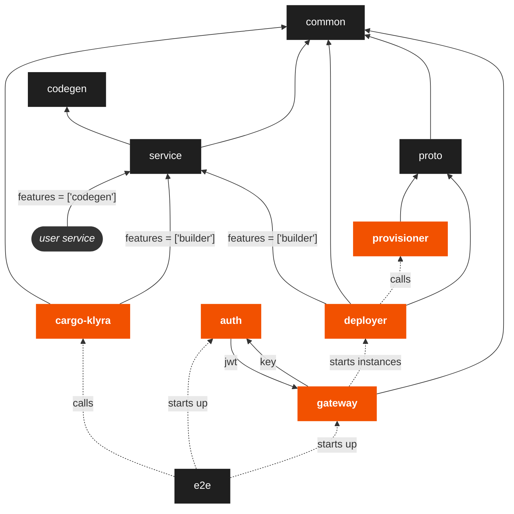

# Contributing

## Tenets

Our goal with klyra open-source maintenance is to foster a thriving, collaborative, and sustainable ecosystem around the project, which allows it to continue to grow and evolve over time.

We will strive to adhere to the following tenets:

1. Encourage collaboration: One of the primary objectives of maintenance is to encourage collaboration among contributors. This can be achieved by creating an atmosphere where people feel safe and encouraged to ask questions on PRs and issues. Contributors should feel comfortable asking for clarification, discussing issues, and proposing solutions without fear of criticism or hostility.
2. Communicate transparently: Another objective of maintenance is to ensure transparent communication about the project's goals, progress, and roadmap. This includes providing regular updates on project status, notifying contributors about relevant changes, and communicating expectations for contributions. This creates an environment where people feel they are in the know of things, which helps them feel invested in the project's success.
3. Recognize contributions: Another important objective of maintenance is to recognize contributors' efforts and contributions. This can be achieved by acknowledging contributions publicly, providing feedback and support, and actively engaging with contributors. This creates an environment where people feel their efforts were helpful and that their contributions are valued.
4. Provide support: Finally, an important objective of maintenance is to provide support to contributors when needed. This includes providing guidance on how to contribute, responding to questions and concerns, and helping contributors resolve issues. This creates an environment where people feel they will get help when needed, which helps build trust and fosters collaboration.

## Raise an Issue

Raising [issues](https://github.com/klyra-hq/klyra/issues) is encouraged.

## Docs

If you found an error in our docs, or you simply want to make them better, contributions to our [docs](https://github.com/klyra-hq/klyra-docs)
are always appreciated!

## Running Locally

You can use Docker and docker-compose to test klyra locally during development. See the [Docker install](https://docs.docker.com/get-docker/)
and [docker-compose install](https://docs.docker.com/compose/install/) instructions if you do not have them installed already.

> Note for Windows: The current [Makefile](https://github.com/klyra-hq/klyra/blob/main/Makefile) does not work on Windows systems by itself - if you want to build the local environment on Windows you could use [Windows Subsystem for Linux](https://learn.microsoft.com/en-us/windows/wsl/install). Additional Windows considerations are listed at the bottom of this page.
> Note for Linux: When building on Linux systems, if the error unknown flag: --build-arg is received, install the docker-buildx package using the package management tool for your particular system.

Clone the klyra repository (or your fork):

```bash
git clone git@github.com:klyra-hq/klyra.git
cd klyra
```

> Note: We need the git tags for the local development workflow, but they may not be included when you clone the repository.
To make sure you have them, run `git fetch upstream --tags`, where upstream is the name of the klyra remote repository.

You should now be ready to setup a local environment to test code changes to core `klyra` packages as follows:

From the root of the klyra repo, build the required images with:

```bash
USE_PANAMAX=disable make images
```

> Note: The stack uses [panamax](https://github.com/panamax-rs/panamax) by default to mirror crates.io content. We do this in order to avoid overloading upstream mirrors and hitting rate limits. After syncing the cache, expect to see the panamax volume take about 100GiB of space. This may not be desirable for local testing. To avoid using panamax, run `USE_PANAMAX=disable make images` instead.

The images get built with [cargo-chef](https://github.com/LukeMathWalker/cargo-chef) and therefore support incremental builds (most of the time). So they will be much faster to re-build after an incremental change in your code - should you wish to deploy it locally straight away.

You can now start a local deployment of klyra and the required containers with:

```bash
USE_PANAMAX=disable make up
```

> Note: `make up` does not start [panamax](https://github.com/panamax-rs/panamax) by default, if you do need to start panamax for local development, run this command with `make COMPOSE_PROFILES=panamax up`.

> Note: Other useful commands can be found within the [Makefile](https://github.com/klyra-hq/klyra/blob/main/Makefile).

The API is now accessible on `localhost:8000` (for app proxies) and `localhost:8001` (for the control plane). When running `cargo run --bin cargo-klyra` (in a debug build), the CLI will point itself to `localhost` for its API calls.

In order to test local changes to the library crates, you may want to add the below to a `.cargo/config.toml` file. (See [Overriding Dependencies](https://doc.rust-lang.org/cargo/reference/overriding-dependencies.html) for more)

```toml
[patch.crates-io]
klyra-service = { path = "[base]/klyra/service" }
klyra-runtime = { path = "[base]/klyra/runtime" }

klyra-aws-rds = { path = "[base]/klyra/resources/aws-rds" }
klyra-persist = { path = "[base]/klyra/resources/persist" }
klyra-shared-db = { path = "[base]/klyra/resources/shared-db" }
klyra-secrets = { path = "[base]/klyra/resources/secrets" }
klyra-static-folder = { path = "[base]/klyra/resources/static-folder" }

klyra-axum = { path = "[base]/klyra/services/klyra-axum" }
klyra-actix-web = { path = "[base]/klyra/services/klyra-actix-web" }
klyra-next = { path = "[base]/klyra/services/klyra-next" }
klyra-poem = { path = "[base]/klyra/services/klyra-poem" }
klyra-poise = { path = "[base]/klyra/services/klyra-poise" }
klyra-rocket = { path = "[base]/klyra/services/klyra-rocket" }
klyra-salvo = { path = "[base]/klyra/services/klyra-salvo" }
klyra-serenity = { path = "[base]/klyra/services/klyra-serenity" }
klyra-thruster = { path = "[base]/klyra/services/klyra-thruster" }
klyra-tide = { path = "[base]/klyra/services/klyra-tide" }
klyra-tower = { path = "[base]/klyra/services/klyra-tower" }
klyra-warp = { path = "[base]/klyra/services/klyra-warp" }
```

Before we can login to our local instance of klyra, we need to create a user.
The following command inserts a user into the `auth` state with admin privileges:

```bash
# the --key needs to be 16 alphanumeric characters
docker compose --file docker-compose.rendered.yml --project-name klyra-dev exec auth /usr/local/bin/service --state=/var/lib/klyra-auth init --name admin --key dh9z58jttoes3qvt
```

Login to klyra service in a new terminal window from the root of the klyra directory:

```bash
# the --api-kei should be the same one you inserted in the auth state
cargo run --bin cargo-klyra -- login --api-key "dh9z58jttoes3qvt"
```

The [klyra examples](https://github.com/klyra-hq/examples) are linked to the main repo as a [git submodule](https://git-scm.com/book/en/v2/Git-Tools-Submodules), to initialize it run the following commands:

```bash
git submodule init
git submodule update
```

Then `cd` into any example:

```bash
cd examples/rocket/hello-world/
```

Create a new project, this will prompt your local instance of the gateway to
start a deployer container:

```bash
# the --manifest-path is used to locate the root of the klyra workspace
cargo run --manifest-path ../../../Cargo.toml --bin cargo-klyra -- project start
```

Deploy the example:

```bash
cargo run --manifest-path ../../../Cargo.toml --bin cargo-klyra -- deploy
```

Test if the deployment is working:

```bash
# the Host header should match the Host from the deploy output
curl --header "Host: {app}.unstable.klyraapp.rs" localhost:8000/hello
```

View logs from the current deployment:

```bash
# append `--follow` to this command for a live feed of logs
cargo run --manifest-path ../../../Cargo.toml --bin cargo-klyra -- logs
```

### Testing deployer only

The steps outlined above starts all the services used by klyra locally (ie. both `gateway` and `deployer`). However, sometimes you will want to quickly test changes to `deployer` only. To do this replace `make up` with the following:

```bash
# if you didn't do this already, make the images
USE_PANAMAX=disable make images

# then generate the local docker-compose file
make docker-compose.rendered.yml

# then run it
docker compose -f docker-compose.rendered.yml up provisioner
```

This starts the provisioner and the auth service, while preventing `gateway` from starting up.
Next up we need to insert an admin user into the `auth` state using the ID of the `auth`
container and the auth CLI `init` command:

```bash
AUTH_CONTAINER_ID=$(docker ps -qf "name=auth") \
    docker exec $AUTH_CONTAINER_ID ./usr/local/bin/service \
    --state=/var/lib/klyra-auth \
    init --name admin --key test-key
```
> Note: if you have done this already for this container you will get a "UNIQUE constraint failed"
> error, you can ignore this.

We need to make sure we're logged in with the same key we inserted for the admin user in the
previous step:

```bash
cargo klyra login --api-key test-key
```

We're now ready to start a local run of the deployer:

```bash
cargo run -p klyra-deployer -- --provisioner-address http://localhost:3000 --auth-uri http://localhost:8008 --proxy-fqdn local.rs --admin-secret test-key --local --project <project_name>
```

The `<project_name>` needs to match the name of the project that will be deployed to this deployer. This is the `Cargo.toml` or `Klyra.toml` name for the project.

Now that your local deployer is running, you can run commands against using the cargo-klyra CLI.
To do that you should navigate into an example, it needs to have the same project name as the
one you submitted when starting the deployer above. Then you can use the CLI like you normally
would:

```bash
# the manifest path is the path to the root klyra manifest from the example directory
cargo run --bin cargo-klyra --manifest-path="../../../Cargo.toml" -- deploy
```

### Using Podman instead of Docker

If you want to use Podman instead of Docker, you can configure the build process with environment variables.

Use Podman for building container images by setting `DOCKER_BUILD`.
```
export DOCKER_BUILD=podman build --network host
```

The klyra containers expect access to a Docker-compatible API over a socket. Expose a rootless Podman socket either
- [with systemd](https://github.com/containers/podman/tree/main/contrib/systemd), if your system supports it,
    ```sh
    systemctl start --user podman.service
    ```
- or by [running the server directly](https://docs.podman.io/en/latest/markdown/podman-system-service.1.html).
    ```sh
    podman system service --time=0 unix://$XDG_RUNTIME_DIR/podman.sock
    ```
Then set `DOCKER_SOCK` to the *absolute path* of the socket (no protocol prefix).
```sh
export DOCKER_SOCK=$(podman system info -f "{{.Host.RemoteSocket.Path}}")
```

Finally, configure Docker Compose. You can either
- configure Docker Compose to use the Podman socket by setting `DOCKER_HOST` (including the `unix://` protocol prefix),
    ```sh
    export DOCKER_HOST=unix://$(podman system info -f "{{.Host.RemoteSocket.Path}}")
    ```
- or install [Podman Compose](https://github.com/containers/podman-compose) and use it by setting `DOCKER_COMPOSE`.
    ```sh
    export DOCKER_COMPOSE=podman-compose
    ```

If you are using `nftables`, even with `iptables-nft`, it may be necessary to install and configure the [nftables CNI plugins](https://github.com/greenpau/cni-plugins)

## Running Tests

klyra has reasonable test coverage - and we are working on improving this
every day. We encourage PRs to come with tests. If you're not sure about
what a test should look like, feel free to [get in touch](https://discord.gg/klyra).

To run the unit tests for a specific crate, from the root of the repository run:

```bash
# replace <crate-name> with the name of the crate to test, e.g. `klyra-common`
cargo test --package <crate-name> --all-features --lib -- --nocapture
```

To run the integration tests for a specific crate (if it has any), from the root of the repository run:

```bash
# replace <crate-name> with the name of the crate to test, e.g. `cargo-klyra`
cargo test --package <crate-name> --all-features --test '*' -- --nocapture
```

To run the end-to-end tests, from the root of the repository run:

```bash
USE_PANAMAX=disable make test
```

> Note: Running all the end-to-end tests may take a long time, so it is recommended to run individual tests shipped as part of each crate in the workspace first.

## Committing

We use the [Angular Commit Guidelines](https://github.com/angular/angular/blob/master/CONTRIBUTING.md#commit). We expect all commits to conform to these guidelines.

We will squash commits before merging to main. If you do want to squash commits, please do not do so
after the review process has started, the commit history can be useful for reviewers.

Before committing:

- Make sure your commits don't trigger any warnings from Clippy by running: `cargo clippy --tests --all-targets`. If you have a good reason to contradict Clippy, insert an `#[allow(clippy::<lint>)]` macro, so that it won't complain.
- Make sure your code is correctly formatted: `cargo fmt --all --check`.
- Make sure your `Cargo.toml`'s are sorted: `cargo +nightly sort --workspace`. This command uses the [cargo-sort crate](https://crates.io/crates/cargo-sort) to sort the `Cargo.toml` dependencies alphabetically.
- If you've made changes to examples, make sure the above commands are ran there as well.

## Project Layout

The folders in this repository relate to each other as follow:



### Binaries

- `cargo-klyra` is the CLI used by users to initialize, deploy and manage their projects and services on klyra.
- `gateway` starts and manages instances of `deployer`. It proxies commands from the user sent via the CLI on port 8001 and traffic on port 8000 to the correct instance of `deployer`.
- `auth` is an authentication service that creates and manages users. In addition to that, requests to the `gateway` that contain an api-key or cookie will be proxied to the `auth` service where it will be converted to a JWT for authorization between internal services (like a `deployer` requesting a database from
`provisioner`).
- `deployer` is a service that runs in its own docker container, one per user project. It manages a project's deployments and state.
- `provisioner` is a service used for requesting databases and other resources, using a gRPC API.
- `admin` is a simple CLI used for admin tasks like reviving and stopping projects, as well as requesting
and renewing SSL certificates through the acme client in the `gateway`.

### Libraries

- `common` contains shared models and functions used by the other libraries and binaries.
- `codegen` contains our proc-macro code which gets exposed to user services from `runtime`.
The redirect through `runtime` is to make it available under the prettier name of `klyra_runtime::main`.
- `runtime` contains the `alpha` runtime, which embeds a gRPC server and a `Loader` in a service with the `klyra_runtime::main` macro. The gRPC server receives commands from `deployer` like `start` and `stop`. The `Loader` sets up a tracing subscriber and provisions resources for the users service. The `runtime` crate also contains the `klyra-next` binary, which is a standalone runtime binary that is started by the `deployer` or the `cargo-klyra` CLI, responsible for loading and starting `klyra-next` services.
- `service` is where our special `Service` trait is defined. Anything implementing this `Service` can be loaded by the `deployer` and the local runner in `cargo-klyra`. The `service` library also defines the `ResourceBuilder` and `Factory` trais 
which are used in our codegen to provision resources. The `service` library also contains the utilities we use for compiling users
crates with `cargo`.
- `proto` contains the gRPC server and client definitions to allow `deployer` to communicate with `provisioner`, and to allow
the `deployer` and `cargo-klyra` cli to communicate with the `alpha` and `klyra-next` runtimes.
- `resources` contains various implementations of `ResourceBuilder`, which are consumed in the `codegen` to provision resources.
- `services` contains implementations of `Service` for common Rust web frameworks. Anything implementing `Service` can be deployed
by klyra.
- `e2e` just contains tests which starts up the `deployer` in a container and then deploys services to it using `cargo-klyra`.

Lastly, the `user service` is not a folder in this repository, but is the user service that will be deployed by `deployer`.

## Windows Considerations

Currently, if you try to use 'make images' on Windows, you may find that the shell files cannot be read by Bash/WSL. This is due to the fact that Windows may have pulled the files in CRLF format rather than LF[^1], which causes problems with Bash as to run the commands, Linux needs the file in LF format.

Thankfully, we can fix this problem by simply using the `git config core.autocrlf` command to change how Git handles line endings. It takes a single argument:

```bash
git config --global core.autocrlf input
```

This should allow you to run `make images` and other Make commands with no issues.

If you need to change it back for whatever reason, you can just change the last argument from 'input' to 'true' like so:

```bash
git config --global core.autocrlf true
```

After you run this command, you should be able to checkout projects that are maintained using CRLF (Windows) again.

[^1]: https://git-scm.com/book/en/v2/Customizing-Git-Git-Configuration#_core_autocrlf
